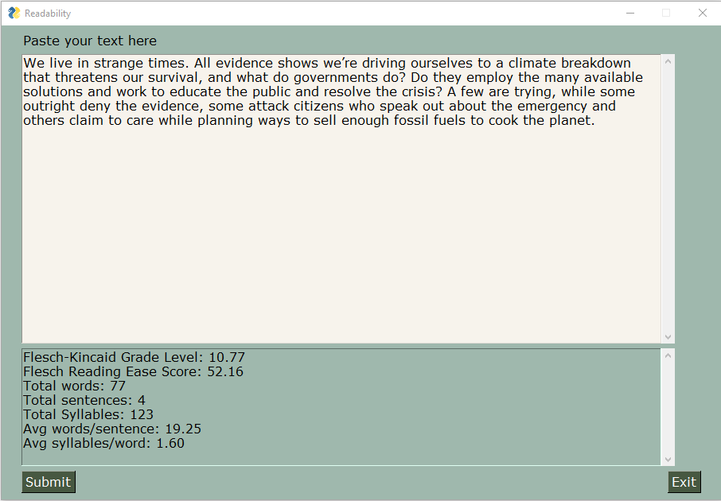

# Technical Writer's Toolkit

A set of tools for technical writers. A work in progress that currently consists only of a Python 3 module and a simple Readability analysis app that uses PySimpleGUI for its interface.

To get the toolkit, clone this repo or download the zip and extract it to a convenient location.

## Module

The Python module provides the following stats for a given text:

1. Flesch-Kincaid Grade Level Score
2. Flesch Reading Ease Score
3. Word count
4. Sentence count
5. Syllable count

Counting syllables can be complicated, but a method that produces reasonable results is to count the number of vowels in a word. That's what I do here but with a few refinements. Runs of multiple adjacent vowels are counted as a single vowel. Special situations such as words that end in 'ale', 'ige' and the like are accounted for. A few outlier words that don't amend themselves to rule-based counting are accounted for ('segue' and 'toque' for example). The letter 'y' is counted as a vowel unless it's the first letter of a word. I haven't done an exhaustive search for exception words. Right now I only account for the ones that came up while testing the algorithm. No doubt there are many more.

The module consists of a bunch of classes and a series of tests. You can refer to the tests to see how to use the toolkit. To run the tests:

On Windows:

    python toolkit.py

On Linux:

    python3 toolkit.py

## Readability App

The readability app uses PySimpleGUI and the toolkit module.

To use the app, you must first install PySimpleGUI.

To install PySimpleGUI on Windows:

    pip install pysimplegui

To install PySimpleGUI on Linux:

    pip3 install pysimplegui

To run the readability app on Windows:

    python readability.py

On run the readability app on Linux:

    python3 readability.py

Paste your text into the window with Ctrl-V and click **Submit**. The window provides a rudimentary editing experience so you can play around with the text and work towards your target score.

